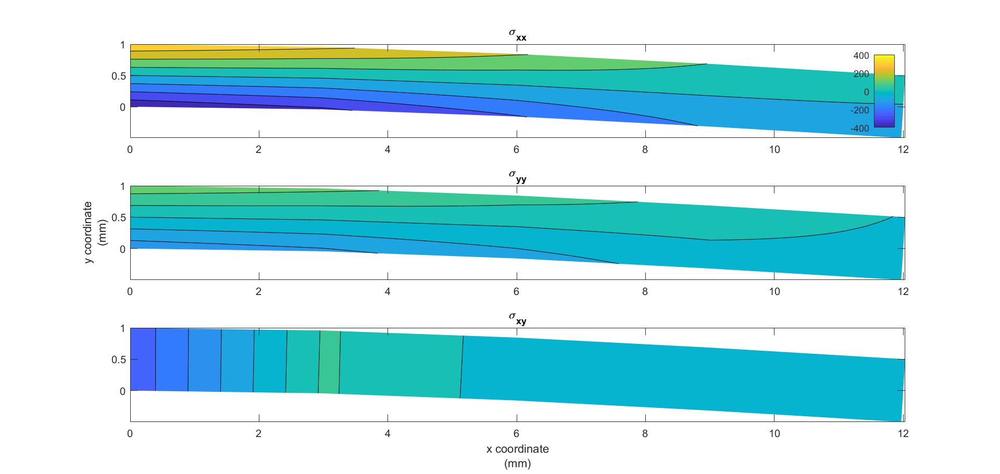
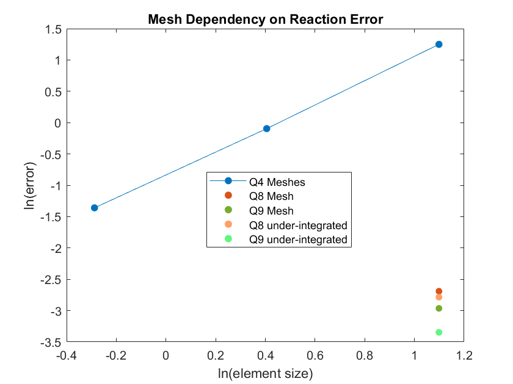
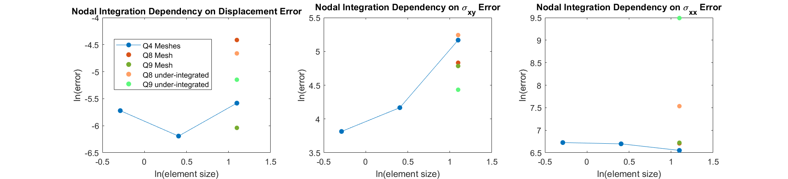
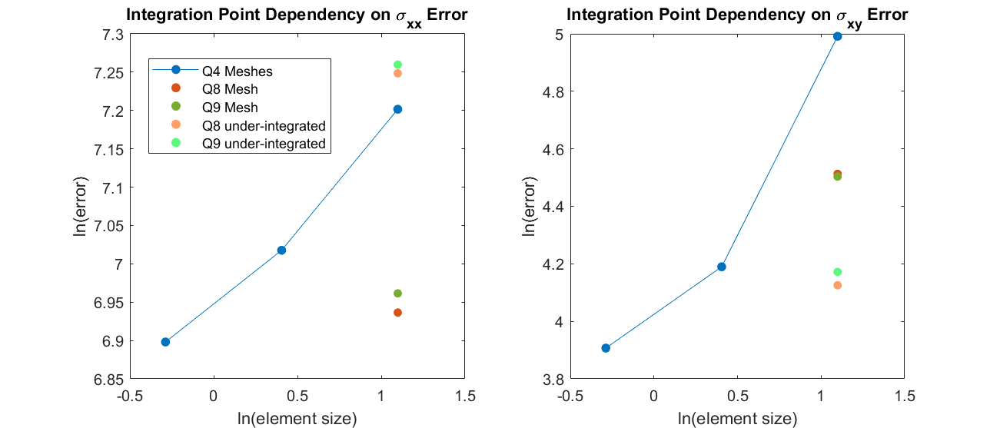
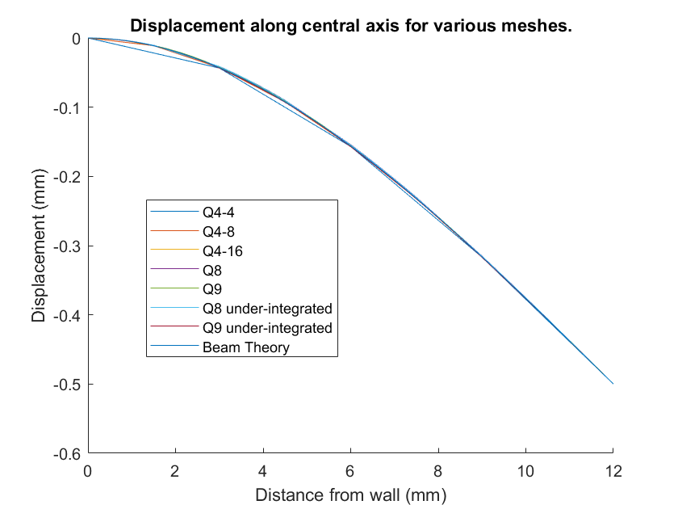
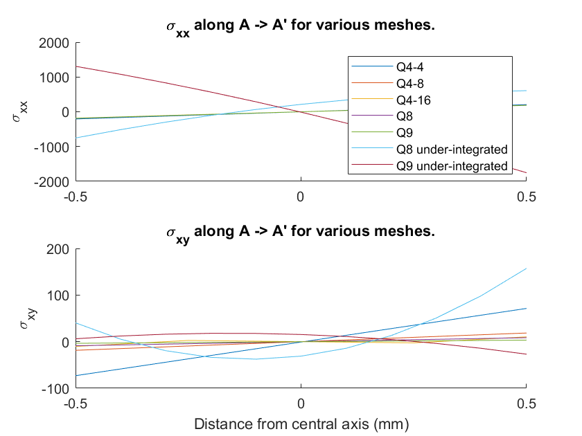
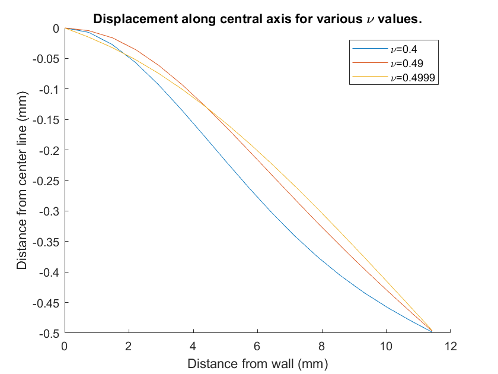
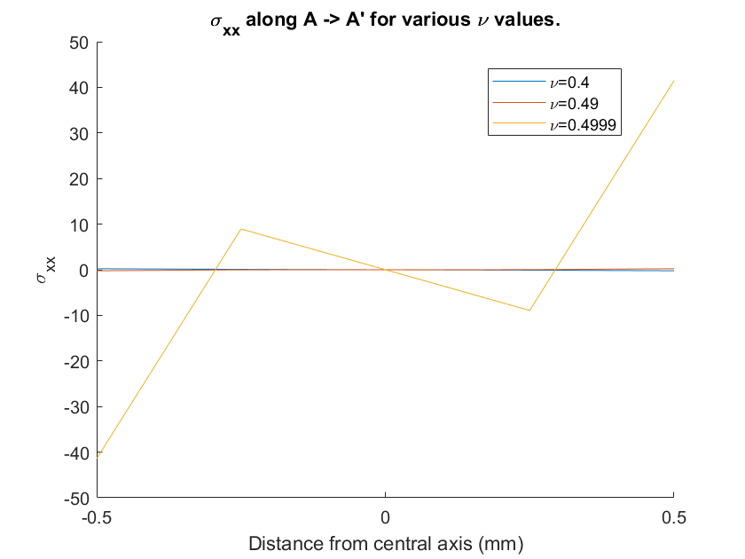

# CSM Midterm | Spring 2020 | Dylan Madisetti

### Introduction

We start with the classical Euler-Bernoulli problem of a massive cantilever
beam with a prescribed displacement at its end.

We note our boundary conditions:

$\text{u}(x=0) = 0$, $\ \ \ \ \ \ \ \ \ \ \ \ \ \text{u}(x=L) = -P$

$\theta(x=0) = 0$, $\ \ \ \ \ \ \ \ \ \ \ \ \ \text{M}(x=L) = 0$

**Figure 1.** Showing Euler-Bernoulli set up.

Using Euler Bernoulli $q = EI \cdot \frac{d^4u}{d x^4}$, we note q to be $\rho
g H B$, and I to be $\frac{BH^3}{12}$.
From that we note:

$$-\sigma_{xy}/EI = \frac{d ^3u}{d x^3} = \frac{qx}{EI} + C_1$$
$$-M/EI = \frac{d ^2u}{d x^2} = \frac{qx^2}{2EI} + C_1x + C_2$$
$$\theta = \frac{d u}{d x} = \frac{qx^3}{6EI} + \frac{x^2}{2}C_1 + C_2x + C_3$$
$$u = \frac{qx^4}{24EI} + \frac{x^3}{6}C_1 + \frac{x^2}{2}C_2  + C_3x + C_4 $$

Applying our boundary conditions yields: $$C_1 = -\frac{5L^4q - 24EIP}{8EIL^3}, C_2 = \frac{L^4q - 24EIP}{8EIL^2}, C_3 = 0, C_4=0$$
and thus

$$u = \frac{qx^4}{24EI} - \frac{x^3}{6}\frac{5L^4q - 24EIP}{8EIL^3} + \frac{x^2}{2}\frac{L^4q - 24EIP}{8EIL^2}$$

The closed form solutions $\sigma_{11} = -\frac{My}{I}$ and $\sigma_{12}$ come
from literature. For the reaction at the wall, we consider a cut at the wall.
Thus,

$$F =
\int_{\Gamma} \sigma \cdot -\hat{e}_x d\Gamma$$

$$F_x =
\int^{\frac{H}{2}}\_{-\frac{H}{2}} -\sigma_{xx}(x=0) dy =
\int^{\frac{H}{2}}\_{-\frac{H}{2}} y\frac{L^4q - 24EIP}{8IL^2} dy
= 0
$$

$$F_y =
\int^{\frac{H}{2}}\_{-\frac{H}{2}} -\sigma_{xy}(x=0) dy =
\int^{\frac{H}{2}}\_{-\frac{H}{2}} \frac{5L^4q - 24EIP}{8L^3} dy =
H\frac{5L^4q - 24EIP}{8L^3}
$$

This toy problem stands as an ideal case study for the study of linear elastic
Finite Element. Provide that $q = \rho g H B$, where $\rho=2000 \frac{kg}{m^3},
H=1mm, B=1mm, g=9.82\frac{m}{s^2}, d=0.5mm$, we note that $F_y = $. See
`euler_sol.m`.

### About the provided code

This code solves Linear Elasticity Finite Element problems. There are 2 unique
things abut this code:

1. There are no loops, except for assembly. The equations are symbolically
solved beforehand. This was intended to provide speedup, however, Matlab's
vectorization means that smart looping is just as fast or even faster than this
implementation. Note, that in a compiled language, this approach would likely
be more optimized.

2. Solving systems of equations are done via Cholesky decomposition. This is
since stiffness and Mass matrices are garunteed to be positive definite.
Cholesky decomposition garuntees $K=RR'$ where R is a triangular matrix.
Thus solving $Kx = f$ turns into $x = K\setminus f =(RR')\setminus F =
R\setminus (R'\setminus F)$ which should be faster since solving triangular
matrices can be quickly done.

For more details, see `README.md`

### Analysis

#### Compressible Beam

We consider the same Euler-Bernoulli problem for `Al` initially. The results of
this can be seen below:

As expected, $\sigma_{xx}$ stems from the base and is balanced about the
central axis, $\sigma_{xy}$ is concentrated at the base and reduces to the end
of the beam, while $\sigma_{yy}$ is near 0. This can be replicated with
`beam_Bending_Q4_4x1_Al.contour_stress()`.

Finite Element is known to have `mesh dependence`. As such, changing our mesh
can influence the answer. Our code uses Gaussian quadrature as a numerical
integration scheme. A quadrature that is not sufficient, will not properly
integrate our weak form formulation. The following results show the reaction
forces for various meshes using 4-point Gaussian quadrature, which `is
sufficent` for the 4 node elements cases, and `is not sufficent` for the 8 node
and 9 node cases.

Higher order meshes more accurately capture the reaction force. Adding more
elements to the lower order meshes also increases accuracy. This follows as
expected. Unexpectedly, lower order integration schemes on the higher order
meshes perform more accurately. This is likely due to error compounding in the
"correct direction", as under integration should always be conservative. This
can be replicated with `plot_mesh_error.m`.

We can additionally compare nodal displacements and stresses. For this we
consider the point `A` shown in **Figure 1**. Here, we consider various element
types and integration types in order to capture mesh dependence and integration
sensitivity. It is worth noting that a lower order Gaussian quadrature will be
faster for large calculations, although less accurate.

For these plots, you can run `plot_integration_error.m`. We see here that lower
order meshes capture the displacement at nodal points relatively well. Higher
order elements may be prone to some level of over-fitting and thus don't perform
as well. Higher order functions do perform better at capturing stress
information. This aligns with expectation as variations in the stress field are
more readily captured. Finally we notice that lower integration points are
capable of capturing more information that the coarsest 4 node mesh, but lack
consistent relationship to full-node integration. This is likely because a poor
integration is the same as introducing some randomness to the system as there
is information loss.

Cross section analysis can also be performed. We note that under plane stress
conditions, we assume that the beam is thick enough to have no $e_z$
dependence. As such, we consider the cross section `A` $\rightarrow$ `A'`. With
no axial loading, we only analyze $\sigma_{xx}$ and $\sigma_{xy}$ which can be
seen in the following figures.

Continuing from last analysis, we notice that the under integrated points do a
poorer job of capturing secondary information like stresses. Here we see the
under integrated components deviate significantly from their counterparts. We
also observe that the stresses approach 0 at the mid-plane, as is expect. The
under integrated components do nicely match Euler-Bernoulli Beam theory for
nodal displacements, as do the rest of the solutions. Notably, the solutions
converge for the boundary conditions. These plots were produced with
`plot_slices.m`.

#### Near incompressible Beam

Finite Element suffers a problem called `locking` on incompressible problems,
where nodal points are unable to move since the movement independently. This is
generally solved by adding a degree of freedom. For a FEM Code (like this one)
without this additional degree of freedom, incompressibility has interesting
effects. This is best examined with beams made of a material like Poly Urethane
(PU). The following shows the displacements of this beam as $\nu\rightarrow 0.5$
(it approaches in compressibility).

We notice from the axis figure, all the samples contract in the x direction
notably. The stiffest case also has the least curvature, while the least stiff
case still shows some compliance. In the stress diagram, we notice extremely
high (relatively) bending stresses. This is as a higher stiffness, results in a
larger required force for the same strain. However, a symmetric 'couple' is
clearly evident. This may be a numerical artifact as $\nu\rightarrow 0.5$
produces increasingly pathological results. The condition number for this
particular stiffness matrix is ~1e-8. Instabilities of this form make sense, as their integrated result will net 0. Results can be replicated with
`plot_compressibility_amount.m`.

It is important to note that mesh dependencies still exist for these cases. We
examine a almost incompressible beam of $\nu=0.4999$ for various mesh sizes and
elements. The following show variation in the `A` $\rightarrow$ `A'`
cross-section.

The same 'couple' mentioned in the previous analysis is also noticed for
different meshes. The lower order meshes are aggressively displaying this which
supports the numerical artifact argument. The higher order mesh is much more
well behaved. In our displacement graph, we notice an inflection point in the
curvature in the higher order element. For a stiff beam, this perturbation
reduces the maximum angle change in the beam. Higher order meshing also reduces
the change of angle at the wall. Figures produced with
`plot_compressibility_amount.m`.
